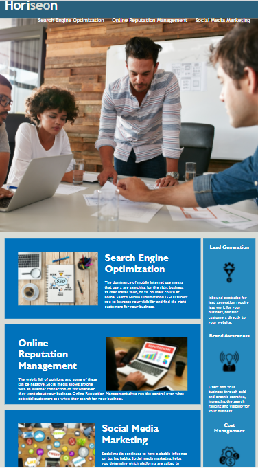

# :trophy: The Horiseon Refactor Challenge :trophy:

## Overview :book:
For this challenge I was assigned to refactor an existing webpage in order to build on accessibility and search engine optimization (SEO) by structuring HTML semantic elements and consolidating CSS selectors.

### User Story :notebook_with_decorative_cover:
```
AS A marketing agency
I WANT a codebase that follows accessibility standards
SO THAT our own site is optimized for search engines
```

### Client's Acceptance Criteria :pencil2:
```
GIVEN a webpage that meets accessibility standards
WHEN I view the source code
THEN I find semantic HTML elements
WHEN I view the structure of the HTML elements
THEN I find that the elements follow a logical structure independent of styling and positioning
WHEN I view the icon and image elements
THEN I find accessible alt attributes
WHEN I view the heading attributes
THEN I find that they fall in sequential order
WHEN I view the title element
THEN I find a concise, descriptive title
```

---
## Features

* Organized content
* Interactive links
* Enhanced attributes for webpage accessibility 

---

## :link: Link to Webpage

Click the following link to visit the webpage:

[A live link to the webpage](https://adorsey5.github.io/refactor/)


The following image is a screenshot of the webpage:



---
## :capital_abcd:Languages and Technology Used :computer:

### Languages
* HTML
* CSS

### Technology

* VSCode
* GitBash
* Emojis from "Markdown Emoji" extension

---

## Acknowledgments

For my first challenge I had a great deal of guidance from:

 * UM Coding Bootcamp Modules/As
 * UM Coding Bootcamp instructor and teacher assistants (TAs)
 * UM Coding Bootcamp Tutor: Jeremy Jones
 * UM Coding Bootcamp Classmates
 * Google

 ---

- - -
© 2021 Asha Dorsey
